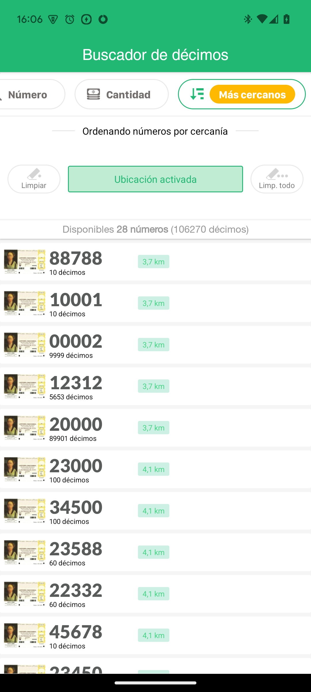

# Prueba técnica Android 2025

## Introducción
La prueba consiste en implementar un buscador de números de Lotería Nacional.

Se tratará de una versión simplificada del que ya funciona en la app. Solamente esta pantalla de buscador de décimos.

La idea es que visualmente y funcionalmente sea lo más similar posible al buscador existente de la app. Aunque quitando algunas partes, para simplificar el ejercicio. El resultado se parecería al siguiente vídeo:

https://github.com/user-attachments/assets/463a823d-f046-4e4e-8bb8-d1636f5dfd1b

## Puntos a implementar
Se proponen los siguientes puntos (en orden de dificultad creciente). No es obligatorio llegar al final, pero cuanto más se consiga, más valoración daremos.

### ⭐ Básico: buscador por números y por cantidad de décimos

Se facilitan las imágenes de los 10 dígitos para los deslizables

Se provee la implementación inicial de varias capas: model, viewmodel, repository, network. Y un MockApiService con mocks de respuesta.

Queda para implementar por el candidato las vistas y el ViewModel, de forma que el funcionamiento sea similar al de la app real en esta sección (aunque limitándonos a buscar por número y cantidad).

### ⭐⭐ Intermedio: animaciones y efectos 
Similares a los que hay en el buscador de la app real o los que se ven en el vídeo.

### ⭐⭐⭐ Avanzado: buscador por cercanía
Habría que calculaar la distancia en KM de cada décimo a la ubicación del dispositivo, y ordenarlos de más cercano a más lejano. Para ello es necesario pedir al usuario permisos de ubicación.)

Ejemplo:

## Notas
En uicomponents se facilitan componentes UI reutilizables

Se valorará que las pantallas y elementos visuales se parezcan lo más posible a las que hay en la app nativa / pantallazo que se provee.

Lo que se evaluará principalmente es que el código sea lo más simple y claro posible, aparte de ser correcto y eficiente.
