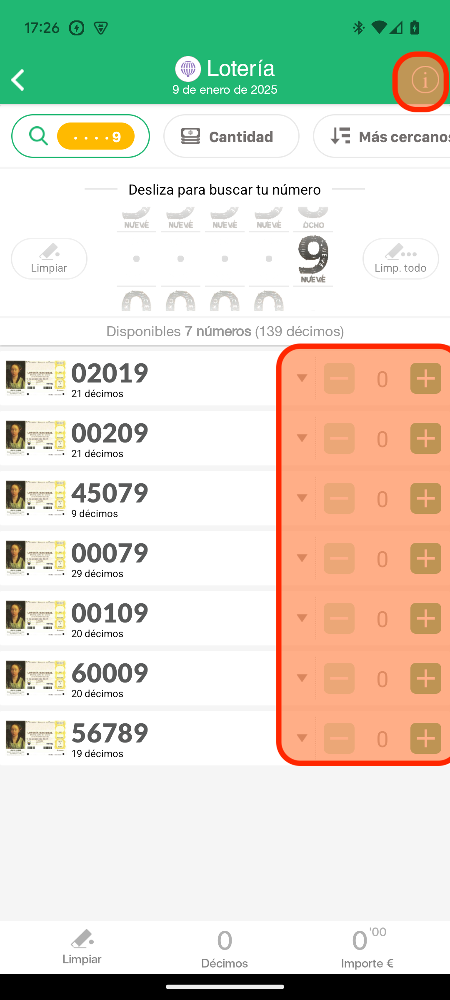

# Prueba técnica Android 2025

## Introducción
La prueba consiste en implementar un buscador de números de Lotería Nacional.

Se tratará de una versión simplificada del que ya funciona en la app. Solamente esta pantalla de buscador de décimos.

La idea es que visualmente y funcionalmente sea lo más similar posible al buscador existente de la app.

## Puntos a implementar
Se proponen los siguientes puntos (en orden de dificultad creciente). No es obligatorio llegar al final, pero cuanto más se consiga, más valoración daremos.

### Básico

#### Buscador por números y por cantidad de décimos

Se facilitan las imágenes de los 10 dígitos para los deslizables
Se provee la implementación inicial de varias capas: model, viewmoodel, repository, network. Y un MockApiService con mocks de respuesta.
Queda para implementar por el candidato las vistas y el ViewModel, de forma que el funionamiento sea similar al de la app real en esta sección (aunque limitándonos a buscar por número y por cantidad).

### Intermedio

#### Animaciones y efectos similares a los que hay en el buscador de la app real.

### Avanzado

#### Buscador por cercanía (Implica petición de permisos, etc)

## Notas
Se valorará que las pantallas y elementos visuales se parezcan lo más posible a las que hay en la app nativa / pantallazo que se provee.

Lo que se evaluará principalmente es que el código sea lo más simple y claro posible, aparte de ser correcto y eficiente.
