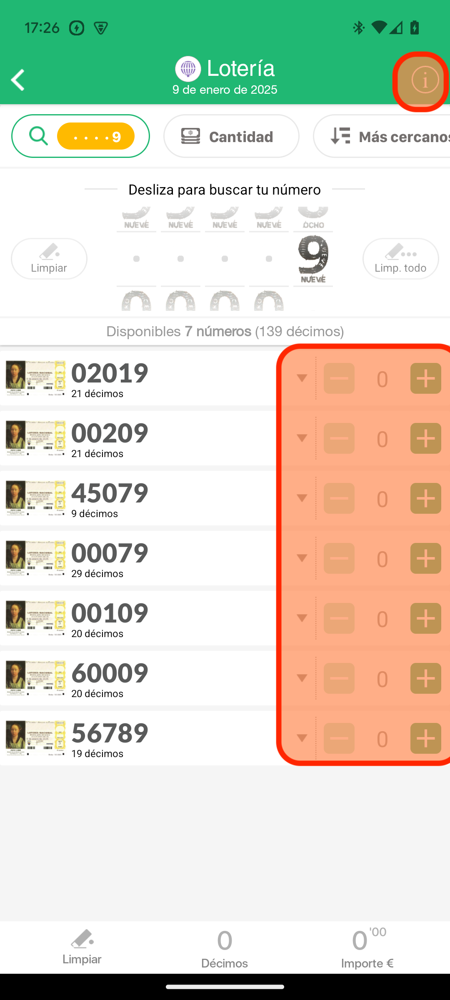

# Prueba técnica Android 2025

## Introducción
La prueba consiste en implementar un buscador de números de Lotería Nacional.

Se tratará de una versión simplificada del que ya funciona en la app. Solamente esta pantalla de buscador de décimos.

La idea es que visualmente y funcionalmente sea lo más similar posible al buscador existente de la app. 

## Puntos a implementar
Se proponen los siguientes puntos (en orden de dificultad creciente). No es obligatorio llegar al final, pero cuanto más se consiga, más valoración daremos.

### Básico

#### Buscador por números
   
  Se facilitan las imágenes de los 10 dígitos para los deslizables

### Intermedio
  
#### Barra de buscadores

#### Buscador por cantidad de décimos

#### Buscador por cercanía
   
  Tener en cuenta petición de permisos

### Avanzado

#### Limitar peticiones
Hacer que las peticiones HTTP tengan algún mecanismo de unbouncing u otro tipo de límite para evitar que el backend deje de devolver resultados por hacerse un número excesivo de peticiones en poco tiempo.

#### Resto de buscadores
Administración y Provincia

#### Detalles
Animaciones y efectos similares a los que hay en el buscador de la app real

## Notas
Se propone que se deduzcan los endpoints y payloads a usar mediante ingeniería inversa de [https://web.tulotero.es/](https://web.tulotero.es/) , es decir, la versión Web, en variante Desktop. Ya que en este caso se usan endpoints anónimos (sin autenticación). La versión móvil real usa el endpoint autenticado, pero para esta prueba tiene que funcionar sin autenticación.

Las pantallas deberían parecerse lo más posible a las que hay en la app nativa, pero excuyendo las partes que tapo en rojo:

Por no complicarlo excesivamente, es suficiente que funcione con compileSdk, minSdkVersion y targetSdkVersion 34

Lo que se evaluará principalmente es que el código sea lo más simple y claro posible, aparte de ser correcto y eficiente.
